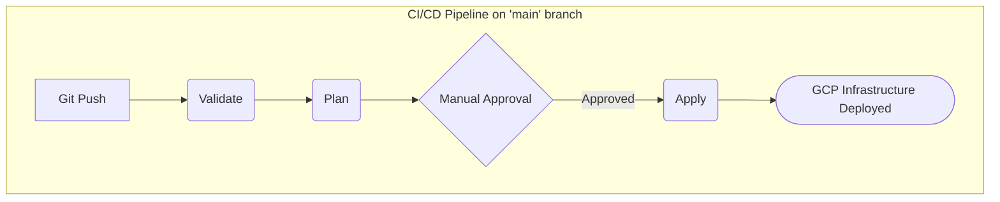

<!---
This README was generated by Gemini Code Assist.
-->
# Terraform on GCP with Azure DevOps CI/CD

[![Azure Pipeline Status]](https://dev.azure.com/YOUR_ORG_NAME/YOUR_PROJECT_NAME/_build/latest?definitionId=YOUR_PIPELINE_DEFINITION_ID)

## Project Goal

This repository contains Terraform code to manage infrastructure on Google Cloud Platform (GCP), orchestrated by a robust CI/CD pipeline in Azure DevOps.

The pipeline is designed with best practices, including separate stages for validation, planning, and application, with manual approvals for production deployments and destruction of resources. It leverages Terraform Cloud as a backend for secure state management and remote execution.

## Pipeline Workflow

The following diagram illustrates the CI/CD process for deployments and the manual workflow for destroying infrastructure.

## Stage Details

The Azure Pipeline is triggered on every push to the `main` branch and follows a multi-stage workflow:

1.  **Validate**: Checks the Terraform code for syntax correctness (`validate`) and proper formatting (`fmt`).
2.  **Plan**: Generates a speculative execution plan in Terraform Cloud to preview the changes. This acts as a dry run.
3.  **Apply**:
    *   **Requires Manual Approval**: This stage will not run until a designated approver signs off within the Azure DevOps environment.
    *   Applies the Terraform configuration to deploy or update infrastructure in GCP.
    *   This stage only runs on the `main` branch.
4.  **Destroy**:
    *   **Requires Manual Approval**: A separate, explicit approval is required to destroy resources.
    *   This stage is conditional and only runs if the pipeline variable `RunDestroy` is set to `true`.

## Prerequisites

To use this pipeline, you will need:

*   An **Azure DevOps** project.
*   A **Google Cloud Platform (GCP)** project with billing enabled.
*   A **Terraform Cloud** account (the free tier is sufficient).

## Setup and Configuration

Follow these steps to configure the necessary connections for the pipeline.

### 1. Terraform Cloud

1.  **Create a Workspace**: In your Terraform Cloud organization, create a new workspace. Select the "CLI-driven workflow".
2.  **Generate an API Token**: Go to your User Settings -> Tokens and create an API token. **Copy this token immediately** as you will not be able to see it again.
3.  **Configure GCP Credentials**: In your Terraform Cloud workspace, go to `Variables`. Add your GCP service account credentials as environment variables. Ensure they are marked as **Sensitive**.
    *   `GOOGLE_CREDENTIALS`: The JSON key file for your GCP service account.
    *   `GOOGLE_PROJECT`: Your GCP Project ID.

### 2. Azure DevOps

1.  **Import Repository**: Import this Git repository into your Azure DevOps project.
2.  **Create a Variable Group**:
    *   Go to **Pipelines -> Library**.
    *   Create a new Variable Group named `terraform-secrets`.
    *   Add a new variable named `TF_API_TOKEN` and paste the Terraform Cloud API token you generated. Mark it as a secret.
3.  **Create Environments for Approvals**:
    *   Go to **Pipelines -> Environments**.
    *   Create a new environment named `prod-approval`.
    *   Click on the environment, go to `Approvals and checks`, and add a manual approval requirement for the appropriate users or groups.
    *   Create a second environment named `prod-destroy-approval` and configure its approvals similarly.
4.  **Create the Pipeline**:
    *   Go to **Pipelines -> Pipelines**.
    *   Create a new pipeline, selecting "Azure Repos Git" and choosing this repository.
    *   Select "Existing Azure Pipelines YAML file" and point it to `/.azure-pipelines.yml`.

## How to Use

### Development Workflow

1.  Create a feature branch from `main`.
2.  Make your Terraform code changes.
3.  Commit and push your branch.
4.  Create a Pull Request to merge into `main`. The `Validate` and `Plan` stages will run automatically, providing feedback directly in the PR.

### Deployment Workflow

1.  Once the Pull Request is reviewed and approved, merge it into the `main` branch.
2.  The pipeline will trigger, running the `Validate` and `Plan` stages.
3.  The `Apply` stage will start and pause, pending manual approval.
4.  An approver must go to the pipeline run in Azure DevOps and approve the deployment to proceed.
5.  Once approved, `terraform apply` will execute.

### Destroying Infrastructure

Destroying the infrastructure is a deliberate and protected action.

1.  In Azure DevOps, go to **Pipelines**.
2.  Select this pipeline and click **Run pipeline**.
3.  In the "Run pipeline" pane, expand **Variables**.
4.  Find the `RunDestroy` variable and change its value to `true`.
5.  Click **Run**.
6.  The pipeline will run through all stages. The `Destroy` stage will pause and wait for manual approval in the `prod-destroy-approval` environment before proceeding to delete all managed resources.

## Contributing

Contributions are welcome! Please open a pull request with your proposed changes. Ensure your code is formatted with `terraform fmt` and passes the validation checks.